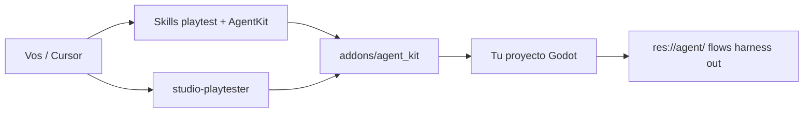

# Godot studio playtest

Módulo **aislado** para playtest con agentes en **Cursor + Godot 4**: el addon **AgentKit**, las skills, el command `/agent-kit` y el subagente `studio-playtester`.

Repo: https://github.com/Joelnicolass/godot-studio-playtest

Extraído de [`godot-studio-skills`](https://github.com/Joelnicolass/godot-studio-skills) (`rc/v0.7.0-spanish`) para que se pueda usar **sin** el resto del studio (orquestador, MpKit, FsmKit, PlatKit, PRD/RFC).

El juego vive en **otro** repo. Acá hay skills, command, subagente, el plugin Godot y el editor experimental de flows.

## Por qué existe

El playtester + AgentKit es más grande que el resto de los kits. Si solo necesitás:

- capturar el viewport
- correr un flow de clicks / `press` / asserts
- inspect de `%UniqueName`
- helpers de playtest **fuera** de `src/`

este repo alcanza. No arrastra Clean Architecture, multiplayer ni el orquestador de producto.

## Qué incluye

| Pieza | Dónde | Qué es |
|-------|--------|--------|
| AgentKit | `addons/agent_kit/` | Plugin Godot: CLI de captura, flow (`try_click` / `repeat`), HTTP, inspect, diff. **Cero** gameplay. |
| Skills | `skills/godot-agent-kit/`, `skills/godot-playtest/` | Cuándo y cómo capturar, escribir JSON/harness, informar PASS/FAIL |
| Subagente | `agents/studio-playtester.md` | Rol que lanza el binario y ejerce el slice |
| Command | `commands/agent-kit.md` | `/agent-kit` |
| Workspace | `res://agent/` (lo crea el instalador) | JSON, harnesses y PNG **del juego** |
| Editor de cables | `experimental/agent-flow-editor/` | Vite + React, localhost. **No** entra en `./install.sh` |

Qué **no** entra: MpKit, FsmKit, PlatKit, orquestador PRD/RFC, GUT, pase visual. Eso sigue en [godot-studio-skills](https://github.com/Joelnicolass/godot-studio-skills).



## Instalar (Cursor)

```bash
./install.sh                 # ~/.cursor/skills, commands, agents
./install.sh --project       # ./.cursor/ del cwd
```

Desde GitHub:

```bash
npx skills add Joelnicolass/godot-studio-playtest -g -a cursor -y
```

`npx skills` solo copia `skills/`. Command, subagente y el addon van con `./install.sh`.

Abrí un **chat nuevo** en Cursor después de instalar.

## Instalar AgentKit en un proyecto Godot

```bash
./install.sh --addon /path/to/godot-project
```

Habilitá el plugin **AgentKit**. CLI:

```bash
addons/agent_kit/cli.sh /ABS/GODOT_ROOT inspect --unique
addons/agent_kit/cli.sh /ABS/GODOT_ROOT flow --flow=boot_smoke.json --fail-on-error
```

JSON y harnesses en `res://agent/` del juego, no en el addon ni en `src/` (spawn / forzar estado / contar / pausar para el flow van al harness). Contrato: skill `godot-agent-kit` → `harness.md`. Un flow largo usa `try_click` y `repeat`. No uses `godot -s /tmp` para capturas.

CI/headless, en `project.godot`:

```
AgentKit="*res://addons/agent_kit/agent_kit.gd"
```

Sin `--agent=`, F5 no cambia.

## Demo

[`example/`](example/README.md) es un proyecto Godot **chico** (un boot + `%PlaySolo`). No es la demo de MpKit.

```bash
example/addons/agent_kit/cli.sh example flow --flow=boot_smoke.json --fail-on-error
```

## Editor de flow (experimental)

Vite + React en localhost para armar el JSON que corre el playtester (`--agent=flow`), vincular `%UniqueName` / InputMap y **Run flow** contra Godot. **No** entra en `./install.sh`. Instalación con **pnpm**.

```bash
cd experimental/agent-flow-editor
pnpm install
pnpm dev
```

http://localhost:5173 — detalle: [`experimental/agent-flow-editor/README.md`](experimental/agent-flow-editor/README.md).

## Layout

```
example/                       # demo Godot 4.7 mínima (boot + flow)
addons/agent_kit/              # plugin Godot (fuente)
skills/
  godot-agent-kit/
  godot-playtest/
agents/studio-playtester.md
commands/agent-kit.md
experimental/agent-flow-editor/
install.sh
```

## Relación con el studio kit

Este módulo **puede** convivir con `godot-studio-skills`. Si ya tenés el studio instalado, AgentKit/playtester coinciden con las mismas piezas; acá están solas para quien no quiere el resto.

Playtest humano sigue pidiendo OK. Visual (`VISUAL.md`) y tests GUT no viven en este repo.
