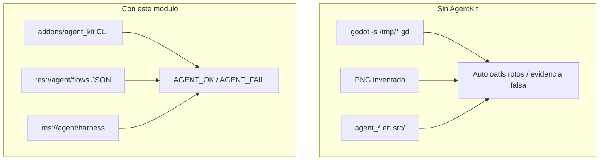
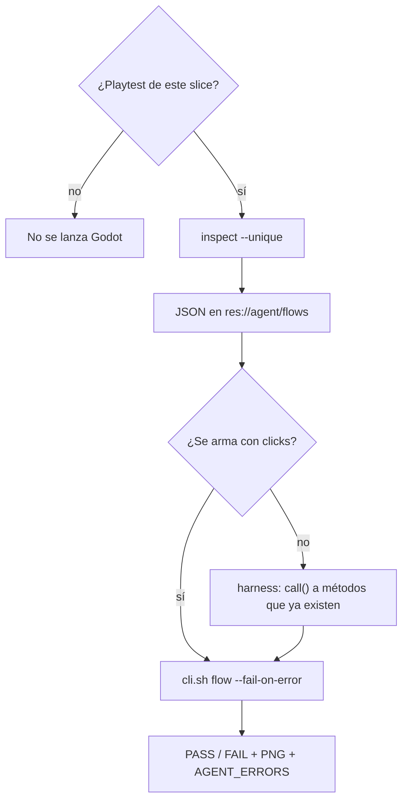

# Godot studio playtest

Playtest de **Godot 4** para agentes en Cursor: capturar el juego de verdad, hacer clicks como un jugador, y no contaminar `src/`.

Repo: https://github.com/Joelnicolass/godot-studio-playtest

El título vive en **otro** proyecto. Este repo instala el plugin, las skills, el command y el subagente.

## Mapa

[](docs/architecture.html)
[](docs/architecture.html)

GitHub muestra una captura. El mapa vivo es [`docs/architecture.html`](docs/architecture.html): abrilo en el navegador (búsqueda, rutas, tema, Present). Fuente: [`docs/architecture.json`](docs/architecture.json).

## Qué problema resuelve

Un agente que “prueba” el juego suele:

1. Tirar `godot -s /tmp/capture.gd` y romper autoloads (`class_name` se compila **antes**).
2. Inventar un PNG o un árbol de nodos de memoria.
3. Meter `agent_setup()` / spawn / forzar estado en el glue de producto.

Acá el contrato es el contrario: el agente habla con Godot por CLI, el flow es JSON, y los helpers viven en `res://agent/`.



## Qué es cada pieza

Cursor distingue **skill** (procedimiento que el agente carga), **command** (prompt que invocás con `/`) y **subagente** (rol aislado, otro contexto). Este repo usa las tres, más un plugin Godot.

| Pieza | Path | Rol |
|-------|------|-----|
| Plugin Godot | `addons/agent_kit/` | Autoload + `cli.sh`: capture, flow, inspect, fetch, diff. Cero gameplay. |
| Skill `godot-agent-kit` | `skills/godot-agent-kit/` | Cómo hablar con el CLI y dónde va el harness. |
| Skill `godot-playtest` | `skills/godot-playtest/` | Cómo ejercer un slice **después** de que el usuario acepte. |
| Command `/agent-kit` | `commands/agent-kit.md` | Atajo humano: captura / flow / inspect ya. |
| Subagente `studio-playtester` | `agents/studio-playtester.md` | Corre el binario y devuelve PASS/FAIL. No escribe producto. |
| Workspace | `res://agent/` en **tu** juego | `flows/`, `harness/`, `out/`. Lo crea el instalador. |
| Editor experimental | `experimental/agent-flow-editor/` | Cables → el mismo JSON. No entra en `./install.sh`. |

El grafo de esas piezas está en [Mapa](#mapa).

## Flujo de playtest

El playtest **no** arranca solo. Hace falta OK explícito.



Reglas cortas:

1. Ejercé **todos** los criterios del slice, no una muestra.
2. Helpers solo en `res://agent/harness/`. Nunca `agent_*` en `src/`.
3. El harness **puede** `call("_on_play")`: en GDScript `_` no es privado de runtime.
4. `capture` / `flow` necesitan **ventana**. `--fail-on-error` tumba el run si Godot logueó ERROR.
5. Un `SCRIPT ERROR` es FAIL aunque el botón se haya podido pulsar.

## Instalar Cursor

```bash
./install.sh              # ~/.cursor/skills, commands, agents
./install.sh --project    # ./.cursor/ del cwd
```

`npx skills add Joelnicolass/godot-studio-playtest -g -a cursor -y` copia **solo** `skills/`. Command, subagente y addon van con `./install.sh`.

Chat **nuevo** en Cursor después de instalar.

## Instalar el plugin en un juego

```bash
./install.sh --addon /path/to/godot-project
```

Habilitá **AgentKit**. En `project.godot` (CI):

```
AgentKit="*res://addons/agent_kit/agent_kit.gd"
```

```bash
addons/agent_kit/cli.sh /ABS/GODOT_ROOT inspect --unique
addons/agent_kit/cli.sh /ABS/GODOT_ROOT flow --flow=boot_smoke.json --fail-on-error
```

`GODOT=` si el binario no está en PATH. Sin `--agent=`, F5 no cambia.

## Demo

[`example/`](example/README.md) es un boot mínimo (`%PlaySolo` → `%AfterPlay`).

```bash
example/addons/agent_kit/cli.sh example flow --flow=boot_smoke.json --fail-on-error
example/addons/agent_kit/cli.sh example flow --flow=call_private_harness.json --fail-on-error
```

## Editor de flow (opcional)

```bash
cd experimental/agent-flow-editor
pnpm install
pnpm dev
```

http://localhost:5173 — mismo JSON que `--agent=flow`. Detalle: [`experimental/agent-flow-editor/README.md`](experimental/agent-flow-editor/README.md).

## Layout

```
addons/agent_kit/                 # plugin Godot (fuente)
skills/godot-agent-kit/           # CLI + harness
skills/godot-playtest/            # playtest humano
agents/studio-playtester.md
commands/agent-kit.md
example/                          # demo Godot 4.7
experimental/agent-flow-editor/
docs/                             # mapa Archify (HTML + PNG)
install.sh
```

## Qué no es

No es un runner de tests unitarios. No es un MCP. No es un motor de juego. No juzga look.
